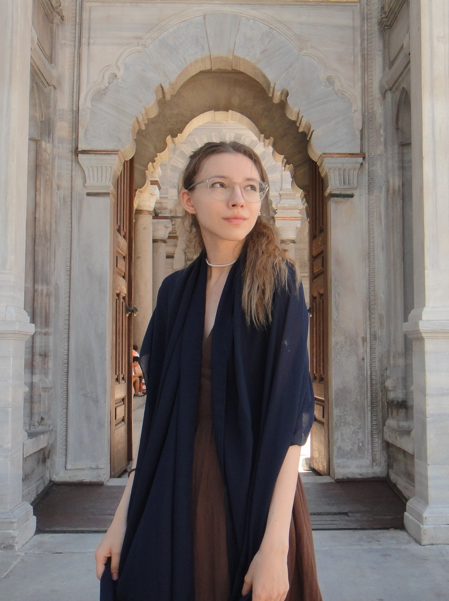

---
# Preamble

## Author
author:
  name: Демидова Екатерина Алексеевна
  degrees: BSc
  orcid: 0009-0005-2255-4025
  email: 1032259377@pfur.ru
  affiliation:
    - name: Российский университет дружбы народов
      country: Российская Федерация
      postal-code: 117198
      city: Москва
      address: ул. Миклухо-Маклая, д. 6
## Title
title: "Лабораторная работа №2"
subtitle: "Шифры перестановки"
license: "CC BY"
date: 2025-09-04
## Generic options
lang: ru-RU
crossref:
  lof-title: Список иллюстраций
  lot-title: Список таблиц
  lol-title: Листинги
## Formats
format:
### Pdf output format
  beamer:
    toc: false
    toc-title: Содержание
    number-sections: true
    colorlinks: false
    toc-depth: 2
    slide_level: 2
    aspectratio: 169
    section-titles: true
    theme: metropolis
    themeoptions: progressbar=frametitle,sectionpage=progressbar,numbering=fraction
#### Language
    babel-lang: russian
    babel-otherlangs: english
### Html output
  revealjs:
    transition: slide
    margin: 0.2
    smaller: false
    output-ext: html
    theme: beige
    logo: _resources/image/logo_rudn.png
---

# Информация

## Докладчик

:::::::::::::: {.columns align=center}
::: {.column width="70%"}

  * Демидова Екатерина Алексеевна
  * студентка группы НФИмд-01-25
  * Российский университет дружбы народов
  * <https://github.com/eademidova>

:::
::: {.column width="30%"}



:::
::::::::::::::

# Введение

**Цель работы**

Основная цель работы -- изучить и реализовать шифры перестановки.

**Задачи**

С помощью языка программирования Julia реализовать:

- маршрутное шифрование,
- шифрование с помощью решеток,
- шифрование с помощью таблицы Виженера.

# Маршрутное шифрование

```julia
function route_cipher(text, password)
    words = split(text)
    letters = collect(join(words))
    len_password = length(password)
    order = sort(collect(enumerate(collect(password))), by=x -> x[2])
    
    while length(letters) % len_password != 0
        push!(letters, rand('а':'я'))
    end
    
    num_rows = length(letters) ÷ len_password
    route_table = reshape(letters, (len_password, num_rows))
    
    ciphered_text = join([join(route_table[ind[1], :]) for ind in order])
    return ciphered_text
end
```

# Шифрование с помощью решеток

```julia
function rot90(matrix, k=1)
    for _ in 1:k
        matrix = reverse(matrix, dims=2)
        matrix = permutedims(matrix, (2, 1))
    end
    return matrix
end
```

# Шифрование с помощью решеток

```julia
function grid_cipher(text, password=nothing)
    # Очищаем текст
    text = lowercase(filter(c -> isletter(c), text))
    letters = collect(text)
    # Определяем размер решётки
    n = ceil(Int, sqrt(length(letters)))
    if n % 2 != 0
        n += 1
    end
    # Дополняем текст случайными буквами
    while length(letters) < n * n
        push!(letters, rand('а':'я'))
    end
    
    k = n ÷ 2
```

# Шифрование с помощью решеток

```julia
    # Создаём маску прорезей
    mask = ones(Int, size(grid))
    
    # Циклически создаём прорези
    for number in 1:k^2+1
        quadrant_order = (number - 1) % 4
        
        if quadrant_order == 0
            quadrant = grid[1:k, 1:k]
            indices = findall(x -> x == number, quadrant)
            if !isempty(indices)
                i, j = indices[1].I
                mask[i, j] = 0
            end
```

# Шифрование с помощью решеток

```julia
# Создаём матрицу для шифротекста
    matrix = fill(' ', n, n)
    text_index = 1
    
    # Записываем текст через решётку с поворотами
    for rotation in 0:3
        # Поворачиваем маску
        rotated_mask = rot90(mask, rotation)
        
        # Записываем символы в позиции прорезей
        for i in 1:n
            for j in 1:n
                if rotated_mask[i, j] == 0 && text_index <= length(letters)
                    matrix[i, j] = letters[text_index]
                    text_index += 1
                end
            end
        end
    end
```

# Шифрование с помощью решеток

```julia
# Создаём базовый квадрат
    square_base = reshape(1:k^2, (k, k))
    
    # Создаём повёрнутые квадраты
    square1 = copy(square_base)
    square2 = rot90(square_base)
    square3 = rot90(square_base, 2)
    square4 = rot90(square_base, 3)
    
    # Собираем полную решётку
    top = vcat(square1, square2)
    bottom = vcat(square4, square3)
    grid = hcat(top, bottom)
```


# Шифрование с помощью решеток

```julia
function rot90(matrix, k=1)
    for _ in 1:k
        matrix = reverse(matrix, dims=2)
        matrix = permutedims(matrix, (2, 1))
    end
    return matrix
end
```

# Шифрование с помощью таблицы Виженера

```julia
function vizhener_cipher(text, password)
    russianAlphabet = collect("абвгдежзийклмнопрстуфхцчшщьыэюя")
    
    # Создаём таблицу Виженера
    table = Matrix{Char}(undef, length(russianAlphabet), length(russianAlphabet))
    for i in 1:length(russianAlphabet)
        for j in 1:length(russianAlphabet)
            idx = (i + j - 2) % length(russianAlphabet) + 1
            table[i, j] = russianAlphabet[idx]
        end
    end
    
    # Получаем сдвиги для пароля
    shift = [findfirst(==(letter), russianAlphabet) for letter in collect(password)]
```

# Шифрование с помощью таблицы Виженера

```julia
    # Очищаем текст
    text = lowercase(filter(c -> isletter(c) && c ∈ 'а':'я', text))
    ciphered_text = Char[]
    count = 1
    
    for letter in text
        ind1 = findfirst(==(letter), russianAlphabet)
        ind2 = shift[(count - 1) % length(shift) + 1]
        count += 1
        push!(ciphered_text, table[ind1, ind2])
    end
    
    return join(ciphered_text)
end
```

# Тестирование

```julia
function main()
    println("Route cipher:")
    text = "нельзя недооценивать противника"
    password = "пароль"
    ciphered_text = route_cipher(text, password)

    println("Grid cipher:")
    text = "договор подписали"
    password = "шифр"
    ciphered_text = grid_cipher(text, password)

    println("Vizhener cipher:")
    text = "криптография серьезная наука"
    password = "математика"
    ciphered_text = vizhener_cipher(text, password)
end
```

# Результат

{#fig-001 width=70%}

# Выводы

С помощью языка программирования Julia были реализованы:

- маршрутное шифрование,
- шифрование с помощью решеток,
- шифрование с помощью таблицы Виженера.
- 
# Список литературы

1. JuliaLang [Электронный ресурс]. 2024 JuliaLang.org contributors. URL: https: //julialang.org/ (дата обращения: 11.10.2024).
2. Julia 1.11 Documentation [Электронный ресурс]. 2024 JuliaLang.org contributors. URL: https://docs.julialang.org/en/v1/ (дата обращения: 11.10.2024).
