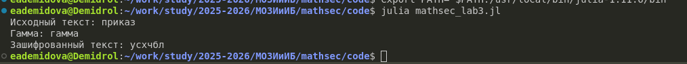

---
# Preamble

## Author
author:
  name: Демидова Екатерина Алексеевна
  degrees: BSc
  orcid: 0009-0005-2255-4025
  email: 1032259377@pfur.ru
  affiliation:
    - name: Российский университет дружбы народов
      country: Российская Федерация
      postal-code: 117198
      city: Москва
      address: ул. Миклухо-Маклая, д. 6
## Title
title: "Лабораторная работа №3"
subtitle: "Шифрование гаммированием"
license: "CC BY"
date: 2025-09-04
## Generic options
lang: ru-RU
crossref:
  lof-title: Список иллюстраций
  lot-title: Список таблиц
  lol-title: Листинги
## Formats
format:
### Pdf output format
  beamer:
    toc: false
    toc-title: Содержание
    number-sections: true
    colorlinks: false
    toc-depth: 2
    slide_level: 2
    aspectratio: 169
    section-titles: true
    theme: metropolis
    themeoptions: progressbar=frametitle,sectionpage=progressbar,numbering=fraction
#### Language
    babel-lang: russian
    babel-otherlangs: english
### Html output
  revealjs:
    transition: slide
    margin: 0.2
    smaller: false
    output-ext: html
    theme: beige
    logo: _resources/image/logo_rudn.png
---

# Информация

## Докладчик

:::::::::::::: {.columns align=center}
::: {.column width="70%"}

  * Демидова Екатерина Алексеевна
  * студентка группы НФИмд-01-25
  * Российский университет дружбы народов
  * <https://github.com/eademidova>

:::
::: {.column width="30%"}


:::
::::::::::::::

# Введение

**Цель работы**

Цель работы -- изучить и реализовать шифры перестшифрование гаммированием.

**Задачи**

С помощью языка программирования Julia реализовать:

- шифрование гаммированием.

# Шифрование гаммированием

```julia
function gamma_cypher(text, gamma; mod=33)
    russian_alphabet = collect("абвгдежзийклмнопрстуфхцчшщьыъэюя")
    
    # Фильтруем текст, оставляя только буквы и приводим к нижнему регистру
    filtered_text = [c for c in lowercase(text) if c in russian_alphabet]
    
    # Преобразуем гамму в числовые значения
    gamma_nums = [findfirst(==(c), russian_alphabet) for c in gamma]
    
    # Создаем повторяющуюся гамму нужной длины
    repeated_gamma = repeat(gamma_nums, ceil(Int, length(filtered_text) / length(gamma_nums)))
```

# Шифрование гаммированием


```julia
    
    cyphered_text = ""
    
    for (a, b) in zip(filtered_text, repeated_gamma)
        # Находим индекс буквы в алфавите
        char_index = findfirst(==(a), russian_alphabet)
        # Вычисляем новый индекс
        new_index = (char_index + b) % mod
        if new_index == 0
            new_index = mod
        end
        # Добавляем соответствующую букву
        cyphered_text *= russian_alphabet[new_index]
    end
    
    return cyphered_text
end
```

# Тестирование

```julia
function main()
    text = "приказ"
    gamma = "гамма"
    cyphered_text = gamma_cypher(text, gamma)
    println("Исходный текст: ", text)
    println("Гамма: ", gamma)
    println("Зашифрованный текст: ", cyphered_text)
end
```

# Результат

{#fig-001 width=70%}

# Выводы

С помощью языка программирования Julia были реализованы:

- шифрование гаммированием.

# Список литературы

1. JuliaLang [Электронный ресурс]. 2024 JuliaLang.org contributors. URL: https: //julialang.org/ (дата обращения: 11.10.2024).
2. Julia 1.11 Documentation [Электронный ресурс]. 2024 JuliaLang.org contributors. URL: https://docs.julialang.org/en/v1/ (дата обращения: 11.10.2024).
