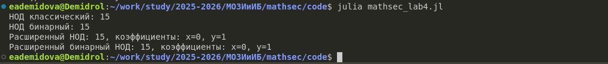

---
# Preamble

## Author
author:
  name: Демидова Екатерина Алексеевна
  degrees: BSc
  orcid: 0009-0005-2255-4025
  email: 1032259377@pfur.ru
  affiliation:
    - name: Российский университет дружбы народов
      country: Российская Федерация
      postal-code: 117198
      city: Москва
      address: ул. Миклухо-Маклая, д. 6
## Title
title: "Лабораторная работа №4"
subtitle: "Вычисление наибольшего общего делителя"
license: "CC BY"
date: 2025-09-04
## Generic options
lang: ru-RU
crossref:
  lof-title: Список иллюстраций
  lot-title: Список таблиц
  lol-title: Листинги
## Formats
format:
### Pdf output format
  beamer:
    toc: false
    toc-title: Содержание
    number-sections: true
    colorlinks: false
    toc-depth: 2
    slide_level: 2
    aspectratio: 169
    section-titles: true
    theme: metropolis
    themeoptions: progressbar=frametitle,sectionpage=progressbar,numbering=fraction
#### Language
    babel-lang: russian
    babel-otherlangs: english
### Html output
  revealjs:
    transition: slide
    margin: 0.2
    smaller: false
    output-ext: html
    theme: beige
    logo: _resources/image/logo_rudn.png
---

# Информация

## Докладчик

:::::::::::::: {.columns align=center}
::: {.column width="70%"}

  * Демидова Екатерина Алексеевна
  * студентка группы НФИмд-01-25
  * Российский университет дружбы народов
  * <https://github.com/eademidova>

:::
::: {.column width="30%"}


:::
::::::::::::::

# Введение

**Цель работы**

Цель работы -- изучить и реализовать алгоритмы вычисления наибольшего общего делителя.

**Задачи**

С помощью языка программирования Julia реализовать:

- классический и расширенный алгоритм Евклида,
- классический и расширенный бинарный алгоритм Евклида,

# Классический алгоритм Евклида

```julia
function nod(a::Int, b::Int)
    if !(b ≤ a && b > 0)
        throw(ArgumentError("Числа a,b не удовлетворяют: 0<b≤a"))
    end
    r0 = a
    r1 = b
    while true
        rem = r0 % r1
        if rem == 0
            return r1
        end
        r0 = r1
        r1 = rem
    end
end
```

# Классический бинарный алгоритм Евклида

```julia
function bin_nod(a::Int, b::Int)
    if !(b ≤ a && b > 0)
        throw(ArgumentError("Числа a,b не удовлетворяют: 0<b≤a"))
    end
    g = 1
    while a % 2 == 0 && b % 2 == 0
        a, b = a ÷ 2, b ÷ 2
        g = 2 * g
    end
    u = a
    v = b
```

# Классический бинарный алгоритм Евклида

```julia
while u != 0
        while u % 2 == 0
            u = u ÷ 2
        end
        while v % 2 == 0
            v = v ÷ 2
        end
        if u ≥ v
            u = u - v
        else
            v = v - u
        end
    end
    d = g * v
    return d
end
```

# Расширенный алгоритм Евклида

```julia
function extended_nod(a::Int, b::Int)
    if !(b ≤ a && b > 0)
        throw(ArgumentError("Числа a,b не удовлетворяют: 0<b≤a"))
    end
    
    r0, r1 = a, b
    x0, x1 = 1, 0
    y0, y1 = 0, 1
```

# Расширенный алгоритм Евклида

```julia
while true
        rem = r0 % r1
        q = r0 ÷ r1
        if rem == 0
            d = r1
            x = x1
            y = y1
            return (d, x, y)
        else
            r0, r1 = r1, rem
            x0, x1 = x1, x0 - q * x1
            y0, y1 = y1, y0 - q * y1
        end
    end
end
```

# Расширенный бинарный алгоритм Евклида

```julia
nction extended_bin_nod(a::Int, b::Int)
    if !(b ≤ a && b > 0)
        throw(ArgumentError("Числа a,b не удовлетворяют: 0<b≤a"))
    end
    
    g = 1
    while a % 2 == 0 && b % 2 == 0
        a, b = a ÷ 2, b ÷ 2
        g = 2 * g
    end
    u, v = a, b
    A, B, C, D = 1, 0, 0, 1
```


# Расширенный бинарный алгоритм Евклида

```julia
    while u != 0
        while u % 2 == 0
            u = u ÷ 2
            if A % 2 == 0 && B % 2 == 0
                A, B = A ÷ 2, B ÷ 2
            else
                A = (A + b) ÷ 2
                B = (B - a) ÷ 2
            end
        end
```

# Расширенный бинарный алгоритм Евклида

```julia
 while v % 2 == 0
            v = v ÷ 2
            if C % 2 == 0 && D % 2 == 0
                C, D = C ÷ 2, D ÷ 2
            else
                C = (C + b) ÷ 2
                D = (D - a) ÷ 2
            end
        end
```

# Расширенный бинарный алгоритм Евклида

```julia
        if u ≥ v
            u = u - v
            A = A - C
            B = B - D
        else
            v = v - u
            C = C - A
            D = D - B
        end
    end
    
    d = g * v
    return (d, C, D)
end
```

# Тестирование

```julia
if abspath(PROGRAM_FILE) == @__FILE__
    println("НОД классический: ", nod(30, 15))
    println("НОД бинарный: ", bin_nod(30, 15))
    
    d, x, y = extended_nod(30, 15)
    println("Расширенный НОД: $d, коэффициенты: x=$x, y=$y")
    
    d_bin, x_bin, y_bin = extended_bin_nod(30, 15)
    println("Расширенный бинарный НОД: $d_bin, коэффициенты: x=$x_bin, y=$y_bin")
end
```

# Результат

{#fig-001 width=70%}

# Выводыcd

С помощью языка программирования Julia были реализованы:

- классический и расширенный алгоритм Евклида,
- классический и расширенный бинарный алгоритм Евклида,
 
# Список литературы

1. JuliaLang [Электронный ресурс]. 2024 JuliaLang.org contributors. URL: https: //julialang.org/ (дата обращения: 11.10.2024).
2. Julia 1.11 Documentation [Электронный ресурс]. 2024 JuliaLang.org contributors. URL: https://docs.julialang.org/en/v1/ (дата обращения: 11.10.2024).
