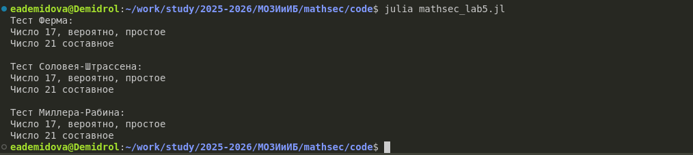

---
# Preamble

## Author
author:
  name: Демидова Екатерина Алексеевна
  degrees: BSc
  orcid: 0009-0005-2255-4025
  email: 1032259377@pfur.ru
  affiliation:
    - name: Российский университет дружбы народов
      country: Российская Федерация
      postal-code: 117198
      city: Москва
      address: ул. Миклухо-Маклая, д. 6
## Title
title: "Лабораторная работа №5"
subtitle: "Вероятностные алгоритмы проверки чисел на простоту"
license: "CC BY"
date: 2025-09-04
## Generic options
lang: ru-RU
crossref:
  lof-title: Список иллюстраций
  lot-title: Список таблиц
  lol-title: Листинги
## Formats
format:
### Pdf output format
  beamer:
    toc: false
    toc-title: Содержание
    number-sections: true
    colorlinks: false
    toc-depth: 2
    slide_level: 2
    aspectratio: 169
    section-titles: true
    theme: metropolis
    themeoptions: progressbar=frametitle,sectionpage=progressbar,numbering=fraction
#### Language
    babel-lang: russian
    babel-otherlangs: english
### Html output
  revealjs:
    transition: slide
    margin: 0.2
    smaller: false
    output-ext: html
    theme: beige
    logo: _resources/image/logo_rudn.png
---

# Информация

## Докладчик

:::::::::::::: {.columns align=center}
::: {.column width="70%"}

  * Демидова Екатерина Алексеевна
  * студентка группы НФИмд-01-25
  * Российский университет дружбы народов
  * <https://github.com/eademidova>

:::
::: {.column width="30%"}


:::
::::::::::::::

# Введение

**Цель работы**

Основная цель работы -- изучить и реализовать вероятностные алгоритмы проверки чисел на простоту.

**Задачи**

С помощью языка программирования Julia реализовать:

- Тест Ферма,
- Тест Соловея-Штрассена,
- Тест Миллера-Рабина.

# Тест Ферма

```julia
function test_ferma(n)
    if n < 5
        throw(ArgumentError("n must be >= 5"))
    end
    a = rand(2:(n-2))
    r = powermod(a, n-1, n)
    if r == 1
        println("Число $n, вероятно, простое")
    else
        println("Число $n составное")
    end
end
```

# Тест Соловея-Штрассена

```julia
function solovei_shtrassen(n)
    if n < 5
        throw(ArgumentError("n must be >= 5"))
    end
    
    a = rand(2:(n-2))
    jacobi = jacobi_symbol(n, a)
    
    if jacobi == 0
        println("Число $n, вероятно, простое")
        return
    end
```

# Тест Соловея-Штрассена

```julia
exponent = (n - 1) ÷ 2
    r = powermod(a, exponent, n)
    
    if r == (jacobi % n)
        println("Число $n, вероятно, простое")
        return
    end
    
    println("Число $n составное")
end
```

# Тест Миллера-Рабина

```julia
function miller_rabin(n)
    if n < 5
        throw(ArgumentError("n must be >= 5"))
    end
    
    r = n - 1
    s = 0
    while r % 2 == 0
        r ÷= 2
        s += 1
    end

    a = rand(2:(n-2))
    y = powermod(a, r, n)
```

# Тест Миллера-Рабина

```julia
 if y != 1 && y != n-1
        j = 1
        while j < s && y != n-1
            y = powermod(y, 2, n)
            if y == 1
                println("Число $n составное")
                return
            end
            j += 1
        end
        
        if y != n-1
            println("Число $n составное")
            return
        end
    end
    
    println("Число $n, вероятно, простое")
end
```

# Тестирование

```julia
println("Тест Ферма:")
test_ferma(17)
test_ferma(21)

println("\nТест Соловея-Штрассена:")
solovei_shtrassen(17)
solovei_shtrassen(21)

println("\nТест Миллера-Рабина:")
miller_rabin(17)
miller_rabin(21)
```

# Результат

{#fig-001 width=70%}

# Выводы

С помощью языка программирования Julia были реализованы:

- Тест Ферма,
- Тест Соловея-Штрассена,
- Тест Миллера-Рабина.
- 
# Список литературы

1. JuliaLang [Электронный ресурс]. 2024 JuliaLang.org contributors. URL: https: //julialang.org/ (дата обращения: 11.10.2024).
2. Julia 1.11 Documentation [Электронный ресурс]. 2024 JuliaLang.org contributors. URL: https://docs.julialang.org/en/v1/ (дата обращения: 11.10.2024).
